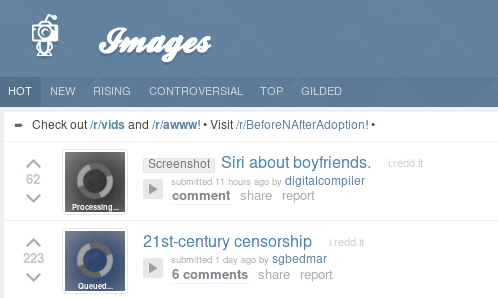

# Trypophobia Image Detector - Browser Plugin using Deep Learning

**Ever wanted to censor images on the web using deep neural networks?**

A deep learning project by [Artur Puzio](https://github.com/cytadela8) and [Grzegorz Uriasz](https://github.com/grzegorz225) made as part of an internship at [deepsense.ai](https://deepsense.ai/) sponsored by [The Polish Children's Fund](https://fundusz.org/english/) and supervised by [Piotr Migdał](http://p.migdal.pl/).

***A browser extension is available for Mozilla Firefox. Try it [here](https://addons.mozilla.org/en-US/firefox/addon/trypophoby-blocker/).***

## Goals
- Create a deep learning model for detecting [trypophobia triggers](https://en.wikipedia.org/wiki/Trypophobia) suitable for running on CPU
- Create a plug and play browser plugin for censoring trypophobic images on the fly while browsing the internet running entirely client-side.
- Prepare a high quality data set for training trypophobia classifiers consisting of a combination of different data sources

## To do list
- ~~Create an utility for scrapping images from Google Images~~
- ~~Create utilities for quick image sorting and image normalization~~
- ~~Create a browser plugin using the WebExtension API capable of censoring images on the fly~~
- ~~Create neural networks suitable for running on a CPU in Javascript~~
- One global browser-wide keras.js instance in the browser plugin, cache predictions based on image fingerprints, create a settings page 
- Polish the browser plugin and ~~publish it in the plugin store(s)~~

## The utilities
The utilities contained in the `utils` folder are small programs and scripts useful in generating the data set and easing the usage of the deep learning lab Neptune.   

## [The data set](https://www.kaggle.com/cytadela8/trypophobia)

*Note: The provided images may be or not be subject to copyright. By downloading the dataset you agree to use it only for research purposes.*

#### Contents

- **6.5k** trypophobia triggering images obtained from:
  - **6k** Reddit (/r/trypophobia) - using [Prawtimestamps by voussoir](https://github.com/voussoir/reddit.git), wget and [Ripme by 4pr0n](https://github.com/4pr0n/ripme)
  - **546** Google images (keyword: trypophobia) - using [our own scrapper](utils/google_images_fetcher)
- **10.5k** neutral images obtained from Google images using [our own scrapper](utils/google_images_fetcher):
  - **10k** by supplying it 5k randomly chosen words from [this](https://github.com/dwyl/english-words) english dictionary and downloading 2 images per word
  - **192** with *bushes* keyword (introduced in v2 to eliminate false positives for greenery)
  - **181** with *grass* keyword (since v2)
  - **98** with *forest* keyword (since v2)
  
#### Structure

Images have been divided into 4 folders

- `/valid/trypo` - 500 random trypophobia triggering images
- `/valid/norm` - 500 random neutral images
- `/train/trypo`- rest of the trypophobia triggering images
- `/train/norm` - rest of the neutral images    

#### Preparation

1. Non-image files and animated images have been removed using [this tool of ours](utils/check_animated.sh) and [this tool of ours](utils/remove_nonimage_files.sh).
2. Downloaded images have been de-duplicated using md5 hashes and a fuzzy deduplication tool available in [digiKam](https://www.digikam.org/).
3. Trypophobia triggers were manually checked and isolated from random spam using [our tool](utils/image_sorter).
4. Images have been rescaled (maintaining aspect ratio) and cropped to 256x256 using [our tool](utils/image_normalizer).
5. Images have been split into train and validation sets using [our tool](utils/split_files.sh).

> Anyone interested in the "raw" unprocessed data please send us an [email](mailto:gorbak25@gmail.com,cytadela8@interia.pl).

## The models
The models were made in the [Keras](https://keras.io/) machine learning framework and are compatible with the [Keras.JS](https://github.com/transcranial/keras-js) javascript library. The models were trained on the Google Computing Platform using [Neptune](https://neptune.ml/). This repository contains some of the [models](models) together with the [training results](training_results). We examined performance of different sized models and decided to aim for one with less than 20k parameters. We achieved up to **90% accuracy and 0.27 log-loss** on the validation set. Additionaly, some models with <10k parameters came close to achieving these results.

## Browser plugin
The browser plugin censors images encountered while browsing the web. It uses a supplied trained model to determine which images are safe to reveal and which a warning must be issued for. The extension is a WebExtension and was tested on Mozilla Firefox. Currently the extension works on most sites. You can try it [here](https://addons.mozilla.org/en-US/firefox/addon/trypophoby-blocker/).
